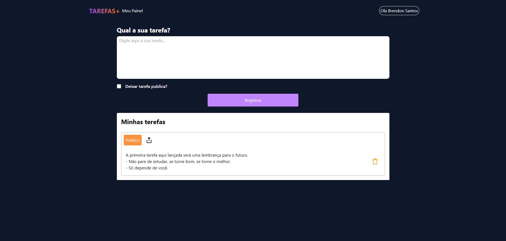

# TAREFAS+

Aplicação desenvolvida por **Brendon Santos** com o objetivo de aprimorar os conhecimentos em **Front-End** utilizando **Next.js**. Este projeto permite que usuários cadastrem, salvem e compartilhem suas tarefas com outros, criando um ambiente colaborativo e prático.

## 🚀 Funcionalidades

- **Autenticação via Google**: O usuário pode se conectar ou cadastrar utilizando sua conta Google.
- **Cadastro de Tarefas**: Dentro da aplicação, é possível criar e salvar tarefas.
- **Compartilhamento de Tarefas**: As tarefas podem ser compartilhadas com amigos por meio de um link (URL).
- **Comentários em Tarefas**: Usuários logados podem comentar em tarefas compartilhadas por amigos.
  
## 💻 Tecnologias Utilizadas

- **Next.js**: Framework React para a criação de interfaces dinâmicas e eficientes.
- **Firebase**: Utilizado para autenticação e armazenamento das tarefas e comentários.

## 📸 Imagens

### Tela Principal


### Tela de Tarefas


### Tela de Comentários


## 🛠️ Como Executar o Projeto

1. Clone o repositório:
   ```bash
   git clone https://github.com/BrendonSant/toDo_list_.git
   
2.Acesse a pasta do projeto
    ```bash
    
     cd toDo_list_
3.Instale as dependências:
    ```bash

    npm install
4.Inicie o servidor de desenvolvimento:
    ```bash

    npm run dev
5.Acesse a aplicação em `http://localhost:3000`.

## 🔗 Link do Projeto
Você pode acessar o projeto em produção aqui.

## 📚 Objetivo
Este projeto foi realizado com o intuito de estudar e aprimorar as habilidades em desenvolvimento front-end, utilizando Next.js e Firebase para uma experiência prática e real.

## 📧 Contato
Caso tenha dúvidas ou sugestões, entre em contato pelo GitHub Brendon Santos.
