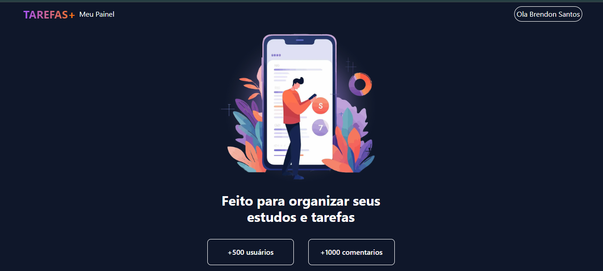
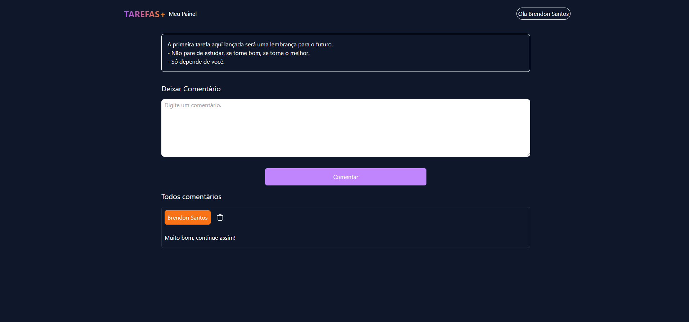

# TAREFAS+

Aplicação desenvolvida por **Brendon Santos** com o objetivo de estudar e aprimorar conhecimentos em **Front-End** utilizando **Next.js**. A aplicação permite que os usuários se conectem via Google, cadastrem tarefas e compartilhem-nas com amigos. Somente usuários logados podem comentar nas tarefas compartilhadas.

## 🚀 Funcionalidades

- **Autenticação via Google**: O usuário pode conectar ou cadastrar uma conta usando o Google.
- **Cadastro de Tarefas**: Criação e salvamento de tarefas diretamente no app.
- **Compartilhamento de Tarefas**: Compartilhamento das tarefas por meio de um link (URL) com amigos.
- **Comentários em Tarefas**: Usuários logados podem comentar nas tarefas compartilhadas.

### 📸 Telas do Projeto

#### Tela Principal


#### Tela de Tarefas


#### Tela de Comentários


## 💻 Tecnologias Utilizadas

- **Next.js**: Framework React para construção de páginas dinâmicas e estáticas.
- **Firebase**: Utilizado para autenticação, armazenamento de tarefas e comentários.
- **Tailwind CSS**: Framework CSS para estilização dos componentes.

## 🔧 Instalação

1. Clone o repositório:
   ```bash
   git clone https://github.com/BrendonSant/toDo_list_.git
2.Acesse a pasta do projeto:
```bash
cd toDo_list_
```
3.Instale as dependências:

```bash
npm install
````
4.Inicie o servidor de desenvolvimento:
```bash
npm run dev
````
5.Acesse a aplicação em `http://localhost:3000`.

## 🧩 Principais Trechos de Código
### Configuração do Firebase
```javascript

import { initializeApp } from 'firebase/app';
import { getFirestore } from 'firebase/firestore';
import { getAuth } from 'firebase/auth';

const firebaseConfig = {
  apiKey: process.env.NEXT_PUBLIC_FIREBASE_API_KEY,
  authDomain: process.env.NEXT_PUBLIC_FIREBASE_AUTH_DOMAIN,
  projectId: process.env.NEXT_PUBLIC_FIREBASE_PROJECT_ID,
  storageBucket: process.env.NEXT_PUBLIC_FIREBASE_STORAGE_BUCKET,
  messagingSenderId: process.env.NEXT_PUBLIC_FIREBASE_MESSAGING_SENDER_ID,
  appId: process.env.NEXT_PUBLIC_FIREBASE_APP_ID,
};

const app = initializeApp(firebaseConfig);
export const db = getFirestore(app);
export const auth = getAuth(app);
````

### Função para adicionar tarefas
```javascript

import { addDoc, collection } from 'firebase/firestore';
import { db } from './firebaseConfig';

export const addTask = async (task) => {
  try {
    const docRef = await addDoc(collection(db, 'tasks'), task);
    console.log('Tarefa adicionada com ID:', docRef.id);
  } catch (e) {
    console.error('Erro ao adicionar tarefa: ', e);
  }
};

````
### Função para compartilhar link da tarefa
```javascript

const shareTask = (taskId) => {
  const taskUrl = `${window.location.origin}/task/${taskId}`;
  navigator.clipboard.writeText(taskUrl);
  alert('Link da tarefa copiado para a área de transferência!');
};

````
## 📚 Objetivo
Este projeto foi realizado com o intuito de estudar e aprimorar as habilidades em desenvolvimento front-end, utilizando Next.js e Firebase para uma experiência prática e real.

## 📧 Contato
Caso tenha dúvidas ou sugestões, entre em contato pelo GitHub Brendon Santos.
